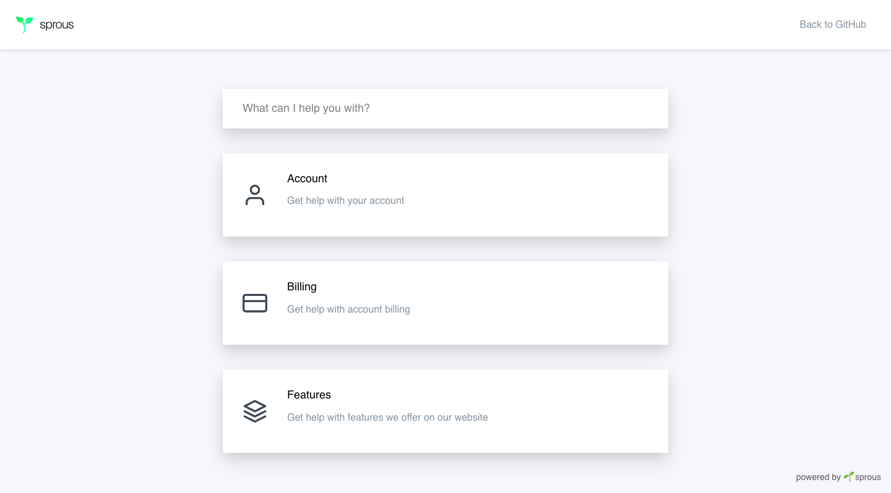
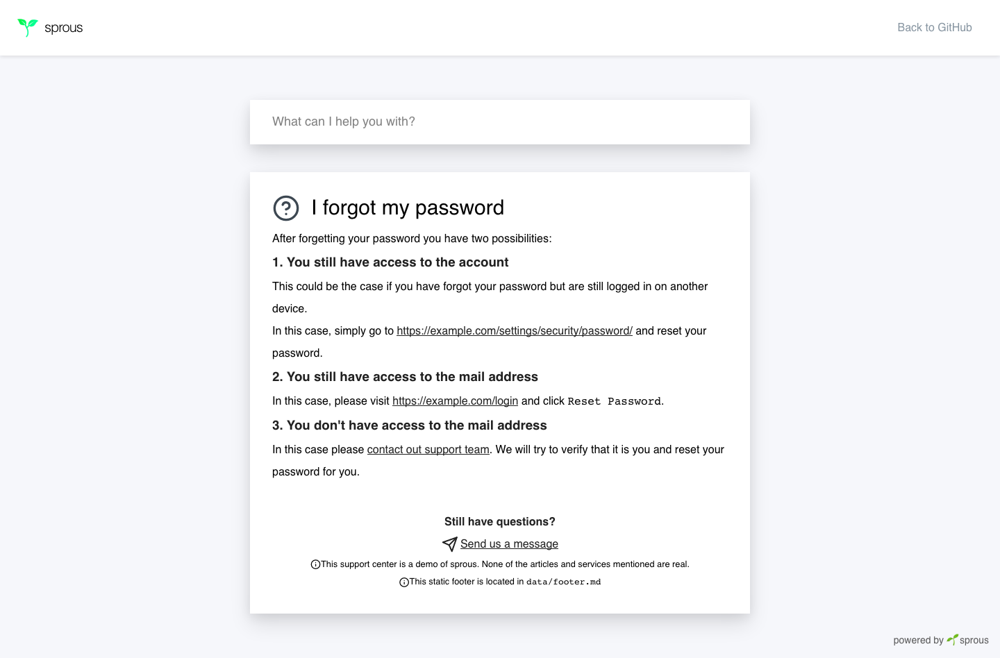

<p align="center">
  <a href="https://sprous.vantezzen.io">
    
  </a>
</p>
<h1 align="center">
  🌱 Sprous
</h1>
<h2 align="center" style="margin-bottom:2rem">
  customer self-support / support system / knowledge base / help desk
</h2>

Add a support system/knowledge base to your website with sprous.

Sprous helps your users by answering common questions in a simple single-page application knowledge base build on [GatsbyJS](https://www.gatsbyjs.org).


- [Features](#features)
- [Demo](#demo)
- [Screenshots](#screenshots)
- [Quick start](#quick-start)
- [Adding pages](#adding-pages)
  - [Creating categories](#creating-categories)
  - [Creating articles](#creating-articles)
- [Static footer](#static-footer)
- [Deploy](#deploy)
- [Contributing](#contributing)
  - [Code of Conduct](#code-of-conduct)
- [Testing](#testing)
- [License](#license)

## Features
- Static single-page website using [GatsbyJS](https://www.gatsbyjs.org)
- Article creation using markdown
- Clean look
- Static footer support
- Article search using [js-search](https://github.com/bvaughn/js-search)

## Demo
You can try a demo of sprous at [https://vantezzen.github.io/sprous](https://vantezzen.github.io/sprous)

## Screenshots
<p align="center">
  
  
</p>


## Quick start

1.  **Download sprous.**

    Download the latest version of sprous from [the releases tab](https://github.com/vantezzen/sprous/releases) or download the latest developement version using `git clone https://github.com/vantezzen/sprous.git`.

2.  **Install dependencies.**

    Navigate into sprous' directory and install all dependencies using
    ```bash
    yarn install
    ```

3.  **Customize sprous.**
    There are several ways to customize sprous:
    - Edit site metadata and settings inside `gatsby-config.js`
    - Change site favicon by replacing `src/images/icon.png`
    - [Customize site footer](#static-footer) inside `data/footer.md` or delete the file to remove the footer
    - Add your custom domain to `package.json` > `homepage` and `gatsby-config.js` > `pathPrefix` to make Gatsby build files fully work
    - Edit styles by modifying 
      - `src/components/layout.css`
      - any of the files inside `src/styles`
      - [TailwindCSS](http://tailwindcss.com/) config file `tailwind.js`
4. **Add your pages.**
    Take a look at [Adding pages](#adding-pages) section for more information on the creation of pages.
5. **Test your page.**
    Start a local developement server using `yarn develop`
6. **Deploy sprous.**
    Create a production-ready build of sprous using
    ```bash
    yarn build
    ```
    Please refer to [GatsbyJS' docs "Deploying and Hosting" section](https://www.gatsbyjs.org/docs/deploying-and-hosting/) if you run into any problems with GatsbyJS.
7. **Upload build to your server**
    You can now upload sprous' static build files, located inside `public/`, to any hosting provider.

## Adding pages
sprous' pages are located inside of subdirectories of `data/` - these subdirectories represent categories of your support page. 
You can also create category-less page files inside of `data/` itself but we advice to only create pages inside of category folders as category-less pages can only be found by searching for them.

When creating files and folders inside of `data/` we advice using hypen-case (`How can I reset by password` => `How-can-I-reset-my-password`) or camelCase (`How can I reset by password` => `HowCanIResetMyPassword`).

Please take a look at `data/` for example categories and articles

### Creating categories
You can create a new category by creating a new folder inside of `data/` with the name of your category (e.g. `billing`). 
You then need to create an `index.md` file inside this folder with the following content:
```md
---
type: "category"
title: "Category title"
description: "Short description that will be shown on the index page"
icon: "HelpCircle"
path: "category"
---
This optional text will be shown on the category page
```
This will define:
- `type: "category"`: Define that this file will define the category information
- `title`: Title/Name of this category
- `description`: Short description of this category. This will be shown on the category list on the index page
- `icon`: Icon that will be used for the category. This icon is part of [Feather Icon](https://feathericons.com/), the icon name has to be *uppercase camelCased* (`credit-card` => `CreditCard`), as the icons are pulled from [react-feather](https://github.com/feathericons/react-feather)
- `path`: Path/URL that the category page will be located at (e.g. `billing` => `https://example.com/billing`)
- In the body of this file you can optionally add a markdown-formatted text that will be shown on the category page

### Creating articles
You can create articles inside of category folders by creating a new markdown file. You can name this file anything you want but we advice to name your article files after the article title.

Inside this file, add your article in this format:
```md
---
type: "article"
title: "Article title"
path: "category/article-title"
category: "category"
---
*Markdown-formatted* Article body
```
This will define:
- `type: "article"`: Define that this file will define an article
- `title`: Title/Name of this article
- `path`: Path/URL that the article page will be located at (e.g. `billing/credit-card` => `https://example.com/billing/credit-card`). This can be any path you want, the category name will *not* be automatically prepended, but we advice you to use the `category-path/article-path` format.
- `category`: Path of the category this article belongs to. This should match the `path` property of the category.
- The body of this markdown file will be the body of your article

## Static footer
sprous has build-in support for a static footer that will be added to the end of all articles. You could use this footer to redirect to other support channels if the user hasn't found an answer yet. Take a look at the default footer located at `data/footer.md` for an example for this.

We advice you to save your footer inside the `data/footer.md` file, but you can rename this file anything you want, as long as the file begins with
```md
---
type: "footer"
---
```
Inside the body of this file you can add the body of your footer.

## Deploy

[](https://app.netlify.com/start/deploy?repository=https://github.com/vantezzen/sprous)

## Contributing
Thank you for your interest in contributing to sprous. Please take a look at [CONTRIBUTING.md](CONTRIBUTING.md) and [CODE_OF_CONDUCT.md](CODE_OF_CONDUCT.md) for more information on how to contribute.

### Code of Conduct
sprous is dedicated to building a welcoming, diverse, safe community. We expect everyone participating in the Gatsby community to abide by our [Code of Conduct](CODE_OF_CONDUCT.md). Please read it. Please follow it. In the Gatsby community, we work hard to build each other up and create amazing things together

## Testing
sprous uses [Jest](https://jestjs.io/) and [react-testing-library](https://github.com/kentcdodds/react-testing-library) for testing.

To test sprous, simply run `yarn test`

## License
Licensed under the [MIT License](license.md)